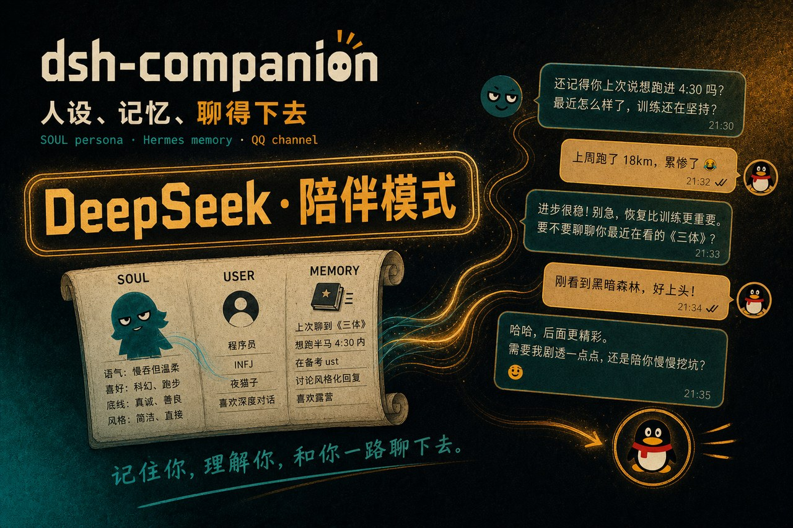

<p align="center">
  
</p>

<p align="center">
  <strong>陪伴插件 dsh-companion</strong> — 人设、记忆、聊得下去
</p>

<p align="center">
  <a href="./LICENSE"></a>
  <a href="https://github.com/topics/dsh-plugin"></a>
  
  
  
</p>

---

聊天 Agent 做陪伴最容易翻车的三件事：

- 每回合重新自我介绍，像刚上线的客服  
- 聊过就忘，上次说好的事下次不认账  
- 人格和记忆各写各的，模型看到的是一锅粥  

**dsh-companion** 是 DeepSeek Harness 的陪伴插件：人格（SOUL）+ 长期记忆（Hermes 风格）+ 可选 QQ 通道，agent 核心（回合循环、会话持久化、搜索、工具注册）全部由 DSH 提供。  
数据来自 [selfloom](https://github.com/yyh-001/selfloom)（单用户陪伴 agent 内核）——**记忆文件零迁移**，`SOUL.md` / `USER.md` / `MEMORY.md` 直接复用。

想配一套表情包？另装 **[dsh-expression](https://github.com/yyh-001/dsh-expression)**（语义检索 + 发图，经本插件的 QQ 通道）——两者独立、可选搭配。

---

## 安装

在 DSH profile 目录（如 `~/.dsh/profiles/web/`）：

```bash
pnpm add file:/path/to/dsh-companion
# 或从 GitHub:
pnpm add github:yyh-001/dsh-companion
```

## 配置

agent preset 里加一行（最简单的做法：从 DSH 的 `standard` 预设拷贝一份，**删掉** `persona` 行——人设由本插件接管，同一作用域不能注册两个同名段）：

```yaml
- id: selfloom-companion
  name: dsh-companion
  config:
    memoriesDir: .selfloom/memories   # 相对路径按会话工作目录解析，也可写绝对路径
    # 可选:QQ 通道——appId/secret 来自 QQ 开放平台(q.qq.com)机器人凭据
    qq:
      enabled: true
      appId: '1905247119'
      clientSecret: 'xxxxxxxxxxxxxxxx'
```

再补一个 `preset.yml`（显示名）：

```yaml
name: 陪伴模式
description: 陪伴 Agent——人设 + Hermes 长期记忆 + 技能目录，核心由 DeepSeek Harness 提供。
```

装完新开一个「陪伴模式」会话即可开聊。

## 装完即用

```text
用户: 你是谁
模型: （读 SOUL.md 的人格 → 以 suki 的身份、损友的语气回应）

用户: 记住我喜欢喝 XX
模型: （调 update_memory 写进 USER.md → 下次会话还记得）

用户: 发表情包
模型: （若装了 dsh-expression → 检索图库 → 经 QQ 通道发图）
```

## 它做什么

| 能力 | 说明 |
|------|------|
| **人设段** `deployment:persona` | `SOUL.md`（人格）+ `USER.md` / `MEMORY.md`（长期记忆）渲染成单文档，遮蔽部署默认人设；每次组装实时渲染，写入后立即刷新，另有 60s 定时兜底 |
| **`update_memory` 工具** | 长期记忆增删改查：`add` / `replace` / `remove`（§ 条目级）、`set` / `clear`（整文件）；字符预算（USER 1375 / MEMORY 2200）+ 超预算合并引导 |
| **QQ 通道**（可选） | 官方 SDK 网关：QQ 消息经 `agent.send` 进陪伴会话，回复经表达层分块回发（带引用回复）；提供 `companionQq` 服务（`sendImage` / `isOnline`）给其他插件消费 |
| **`companion_status` / `qq_status`** | 记忆用量、人设文档、QQ 在线状态自检 |

## 日常命令（模型视角）

```text
update_memory target=user action=add content=「喜欢喝茶」   # 写记忆
update_memory target=memory action=replace old_text=…       # 合并/更新条目
companion_status                                            # 看记忆用量
qq_status                                                   # 看 QQ 网关状态
```

## 给模型的三条铁律

完整约定见人设段与 `update_memory` 工具描述。

1. 接着关系聊：不自我介绍、不「有什么可以帮你」、不客服腔  
2. 记忆只存持久事实（偏好/边界/约定），不存任务进度和临时路径；预算快满先合并再写  
3. 回复按表达层拆气泡：短闲聊一句一条，长文干活保持完整段落

## 接到你的 Agent

| 组件 | 说明 |
|------|------|
| **dsh-companion** | 本插件：人设段 + Hermes 记忆 + QQ 通道（`companionQq` 服务） |
| **[dsh-expression](https://github.com/yyh-001/dsh-expression)** | 表情包插件：语义检索 + 经 `companionQq` 发图 |
| **selfloom** | 数据源：`SOUL.md` / `USER.md` / `MEMORY.md`（§ 条目 + 预算，零迁移） |

```text
dsh-companion/
  index.js        插件本体：人设段 + 记忆工具 + QQ 挂载
  qq.js           QQ 通道：官方 SDK 网关 ↔ agent 会话桥接 + 分块投递 + companionQq 服务
  package.json    name / inject / deps
  README.md
  LICENSE
```

## 已知限制

- 记忆文件跨会话共享，当前每个会话的 store 实例各自读写同一批文件——单用户场景无问题；
- QQ 通道是单目标 MVP：回复发回"最近聊天"目标；扫码登录尚未移植（凭据直接配置即可用）；
- 表情包管理（上传/删除/改元数据）不在此插件——那是 `dsh-expression` 图库维护的事；
- 提醒场景尚未接入（DSH 原生 `@deepseek-ai/dsh-schedule` 可直接覆盖）。

## License

[MIT](./LICENSE)
